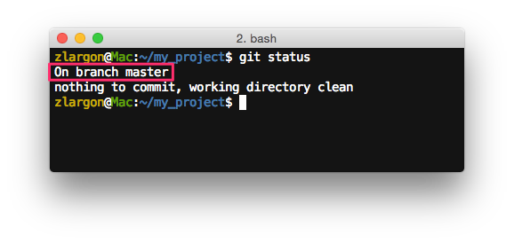
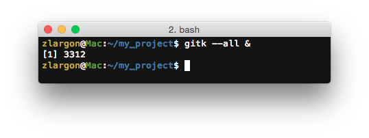
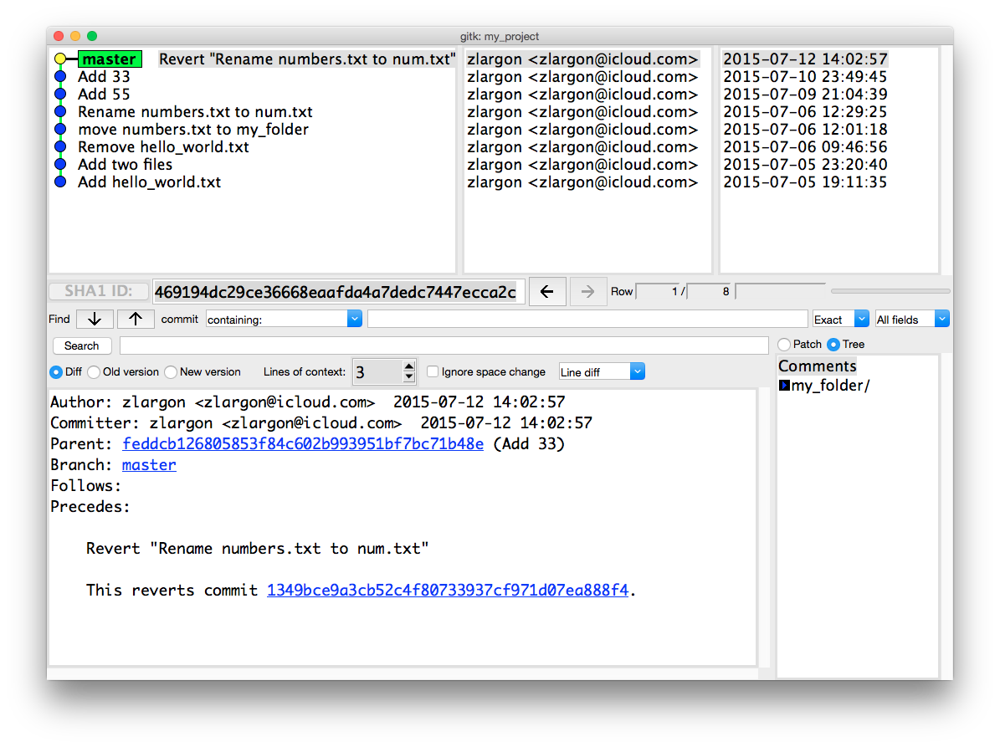

# 查看分支

每次我們下指令 `git status` 的時候，第一行總是會出現 `On branch master`

這是什麼意思呢？



其實一直以來，我們都是在一個叫 `master` 的分支上提交 patch

```
P0  →  P1  →  P2  →  P3  →  P4  →  P5         (master branch)
                                 (HEAD)
```

Git 習慣把 __"主分支"__ 稱為 `master`

當我們一開始使用 `git init` 來建立專案時，分支 `master` 就一起被創出來了

<br>

## 使用 `git branch` 查看所有的分支

    $ git branch


這表示目前只有 `master` 一個分支

而 `master` 前面的 `*` 符號表示，我們現在就在這個分支上

<br>

## 使用 Gik 圖形化介面查看所有的分支

從這一章開始，我們會搭配 `gitk` 來輔助說明

`gitk` 是一個 git 圖形化介面的工具，可以讓我們清楚了解所有 patch 和分支的情況

他內建於 git 的安裝程式，且支援所有平台

所以當你安裝好 git 之後，`gitk` 也就安裝好了


在 git 的專案底下，輸入 `gitk --all` 即可啟動

後面帶 `--all` 才會顯示所有的分支，否則只會顯示目前的分支

如果想要使 `gitk` 在背景執行的話，請記得在最後面輸入 `&`，這樣 `gitk` 才不會佔用終端機

    $ gitk --all &      # 在背景執行 gitk



從 `gitk` 可以一目瞭然的看到所有 patch

* __黃色點點：__<br>
    表示我們目前所在的位置，也就是 `HEAD` 的位置

* __綠色框框：__<br>
    分支的名稱

    > 由於黃點與 `master` 重疊，這表示我們目前位在 `master` 這個分支上



`gitk` 是一個非常陽春的圖形化介面，只能單純觀看所有分支的情況

而且每當我們下了 git 指令去修改後，`gitk` 也不會自動刷新，必須手動按 `F5` 更新

大家也可以上網找自己喜歡的 GUI 軟體，只要可以清楚觀看所有 patch 和分支情況就行了 ^_^

<br>

## 分支的用途

在 Git 的世界裡，我們可以把每個 patch 都看成是一個小節點，每個節點都可以另外長出自己分支

```
                                 o---o---o feature
                                /
o---o---o---o---o---o---o---o---o---o---o  master
         \             /
          o---o---o---o  bugFix
                   \
                    o---o---o  testing
```

這種分支的模型，其實就是一個樹狀的結構，git 稱之為 `Commit Tree`

<br>

Git 的分支模型非常的輕巧，可以讓我們很快速的建立 / 刪除分支

我們可以開一個叫做 `bugFix` 的分支，去修正某個 bug

這時 `master` 跟 `bugFix` 功能可以平行開發，不會互相影響

等 `bugFix` 修完測過沒問題之後，再把他合併回 `master` branch

當我們想要做一些簡單的測試時，也可以快速的建立一個測試用的分支，等測完之後再把 branch 砍掉

<br>

## 本章回顧

* 使用 `git branch` 查看所有的分支

* 使用 `gik --all &` 啟動圖形化介面

<br><br><br>
