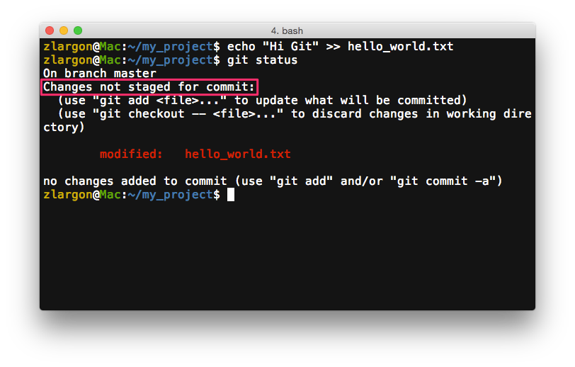
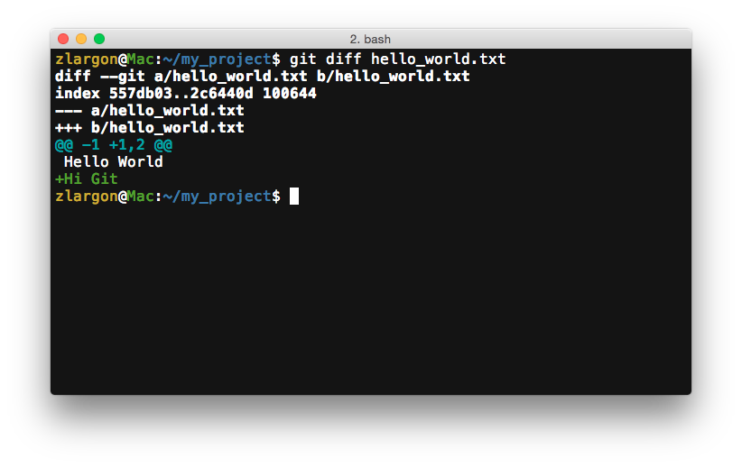
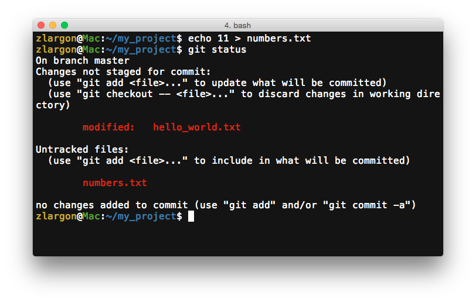
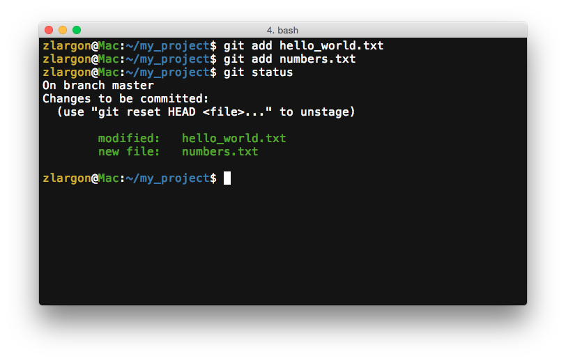
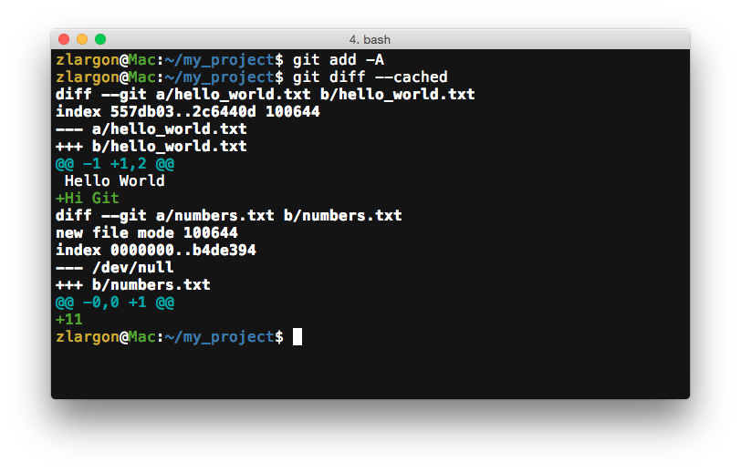
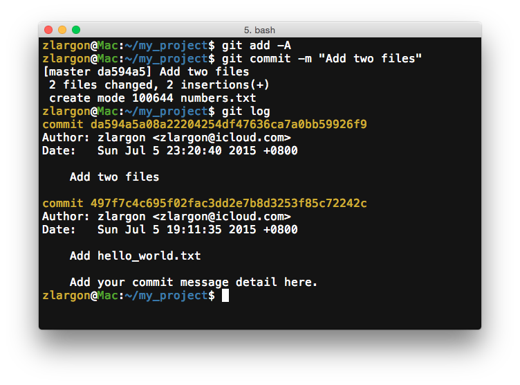
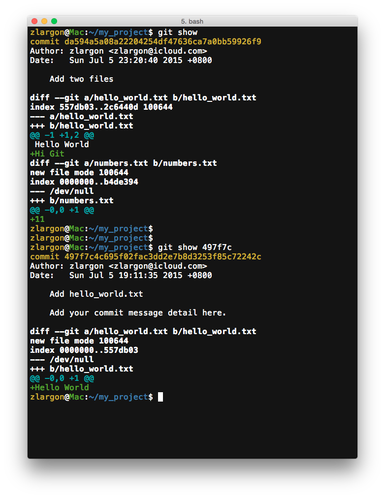

# 新增 / 修改檔案

我們現在對剛才所新增的 `hello_world.txt` 進行修改

在檔案的最後面新增一行字串 "Hi Git"，並且使用 `git status` 來查看檔案狀態



`hello_world.txt` 的狀態變成 ___Changes not staged for commit___

表示這個檔案被修改了，但是尚未要進行提交（稍後我們會在 ["檔案狀態"](status.md) 做更詳細的解釋）

<br>

## 使用 `git diff <file>` 查看 "特定" 被修改檔案的內容

```
$ git diff hello_world.txt
```



透過 `git diff` 可以看出 ` hello_world.txt` 的最底下新增了一行 "Hi Git" 的字串

`git diff` 其實是把當前的狀態，與最後一個 patch 做比對

<pre style="border: 1px solid grey">
<span style="color: green">+Hi Git</span>
</pre>

"Hi Git" 前面的加號，表示新增的意思

<br>

## 使用 `git diff` 查看 "全部" 被修改檔案的內容

若有多個檔案被同時修改，可以直接使用 `git diff` 查看所有的檔案被修改的內容

由於我們目前只有一個被修改的檔案，因此效果會與 `git diff hello_world.txt` 相同

<br>

現在我們另外新增一個檔案 `numbers.txt` 內容為一行字串 "11"

然後再用 `git status` 去檢視狀態



我們可以看到 `numbers.txt` 的狀態是 ___Untracked files___

這時候我們再做一次 `git diff`，依然只能看到 `hello_world.txt` 的變化，但是看不到 `numbers.txt` 的部分

這是因為 `numbers.txt` 的狀態是 ___Untracked files___，所以 git 本來就不會去追蹤他內容的變化

<br>

接下來，我們要用 `git add` 來告知 git，哪些是我們將要 commit 的檔案

```
$ git add hello_world.txt
$ git add numbers.txt
```



#### 檔案狀態改變：

* __hello\_world.txt__

    <span style="color: red">_Changes not staged for commit</span> → <span style="color: green">Changes to be committed_</span>

* __numbers.txt__

    <span style="color: red">_Untracked files</span> → <span style="color: green">Changes to be committed_</span>

<br>

## 使用 `git add -A` 加入全部的檔案

git 有提供一個快速的方法，可以一次 `add` 全部的檔案，那就是在 `git add` 後面加上 `-A` 或是 `--all` 的參數

```
$ git add -A        # 一次 add 所有的檔案
$ git add --all     # 同上
```

不論檔案狀態是 ___Untracked files___ 或是 ___Changes not staged for commit___（<span style="color: red">紅色</span>），都會一口氣變成 ___Changes to be committed___（<span style="color: green">綠色</span>）

<br>

## 使用 `git diff --cached` 來檢視 _Changes to be committed_ 的修改內容

`git diff` 只能檢視 ___Changes not staged for commit___ 區塊的修改內容

如果想要檢視 ___Changes to be committed___ 的修改內容，就必須在後面加上 `--cached` 或是 `--staged` 的參數

```
$ git diff --cached     # 檢視綠色部分的內容
$ git diff --staged     # --staged 等同於 --cached
```



<br>

## 使用 `git commit -m <message>` 來提交（不啟動文字編輯模式）

`git commit` 後面可以接數個 `-m <message>`，每一段的 message 都會被一個空行隔開

```
$ git commit -m <title>                             # 只要提交 title
$ git commit -m <title> -m <message>                # 提交 title 以及 message
$ git commit -m <title> -m <msg1> -m <msg2> ....    # 提交多個 messages
```

使用 `git commit -m` 完之後，再用 `git log` 檢視提交歷史訊息

```
$ git commit -m "Add two files"
$ git log
```



<br>

## 使用 `git show <commit_id>` 來檢視之前提交的 patch 所修改的內容

現在我們的專案裡面，已經有兩個 patch 了

`git show` 只能查看最後一次提交的 patch 所修改內容

若要看其他的 patch 就必須要在後面加上 `commit id`

通常只要給 `commit id` 的前六碼，git 就可以認得了

```
$ git show                                          # 查看最後一次 commit 的 patch
$ git show 497f7c4c695f02fac3dd2e7b8d3253f85c72242c # 查看首次 commit 的 patch
$ git show 497f7c                                   # 同上
```



<br>

## 本章回顧

* 使用 `git diff` 查看 "全部" 檔案被修改的內容

* 使用 `git diff <file>` 查看 "特定" 檔案被修改的內容

* 使用 `git diff --cached` 查看 _Changes to be committed_ 的修改內容

* 使用 `git add -A` 加入全部的檔案

* 使用 `git commit -m <message>` 來提交（不啟動文字編輯模式）

* 使用 `git show <commit_id>` 來查看特定 patch 修改的內容
