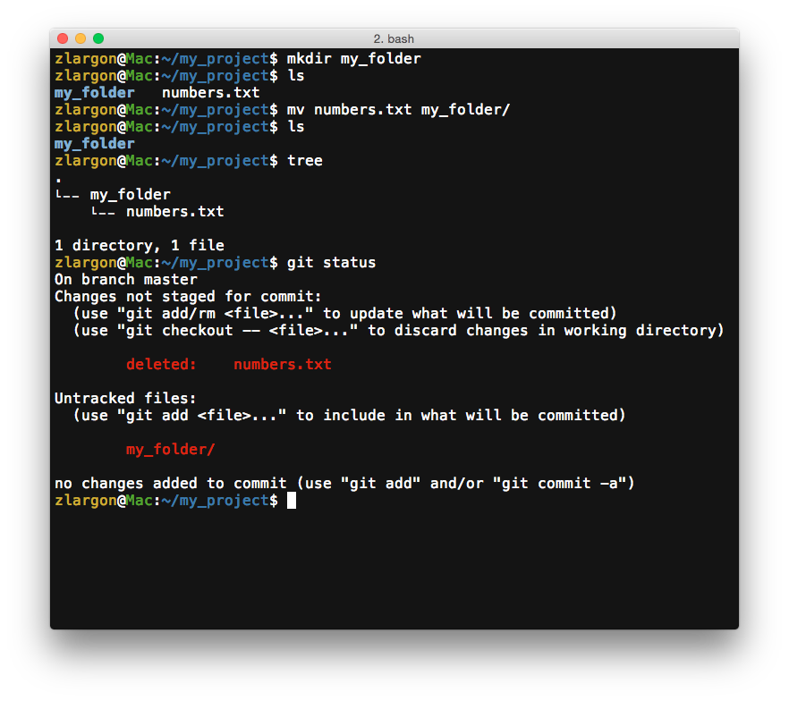
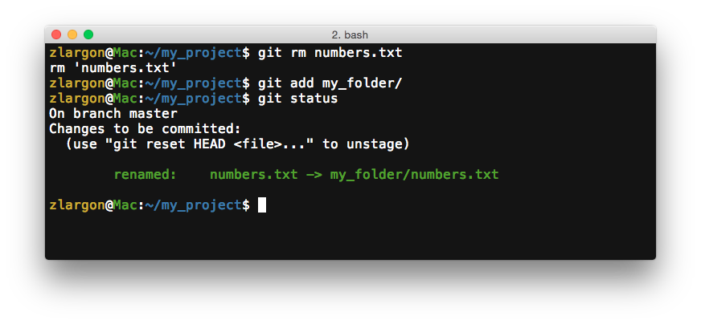
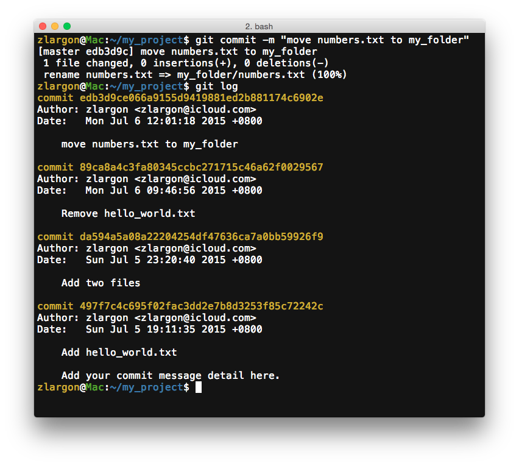

# 搬移檔案

我們先新增一個資料夾 `my_folder`

然後再把 `numbers.txt` 移到 `my_folder/` 底下，並用 `git status` 觀察檔案的狀態

```
$ mkdir my_folder
$ mv numbers.txt my_folder/
$ git status
```



目前檔案結構為

    .
    └── my_folder/
        └── numbers.txt

我們會看到原本 `numbers.txt` 的狀態變成 ___Changes not staged for commit (deleted)___，而 ___Untracked files___ 區塊多一個 `my_folder/` 的資料夾

對 git 而言，可以看成是：
* 把原本的 `numbers.txt` 檔案刪除
* 在 `my_folder/` 底下，新增一個一模一樣的檔案 `numbers.txt`

現在我們用 `git add/rm` 來加入新增 / 刪除的檔案，並用 `git status` 查看目前的狀態

> 這裡也可以用 `git add -A` 一次加入全部的檔案

```
$ git rm numbers.txt
$ git add my_folder/
$ git status
```



`numbers.txt` 的狀態變成 ___Changes to be committed (renamed)___

我們可以看出搬移 `numbers.txt` 檔案的操作，對 git 而言，也可以看成是一種 "重新命名" 的概念

<br>

## 使用 `git mv <file> <directory>` 來搬移檔案

以上的搬移步驟，其實可以簡化成兩個步驟

* 新增資料夾 `my_folder/`
* 告訴 git，我要將 `numbers.txt` 移到資料夾 `my_folder/` 底下

```
$ mkdir my_folder
$ git mv numbers.txt my_folder/
```

這樣就不用再多做 git add/rm 的動作了

這裡 `mv` 的意思就是 `move`

<br>

提交 patch，並用 `git log` 來查看提交歷史紀錄

```
$ git commit -m "move numbers.txt to my_folder"
$ git log
```


