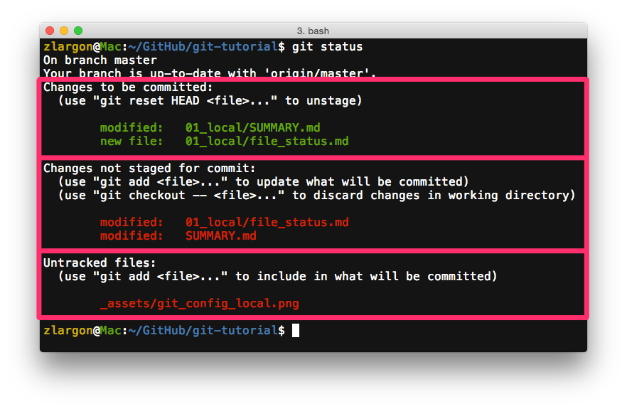
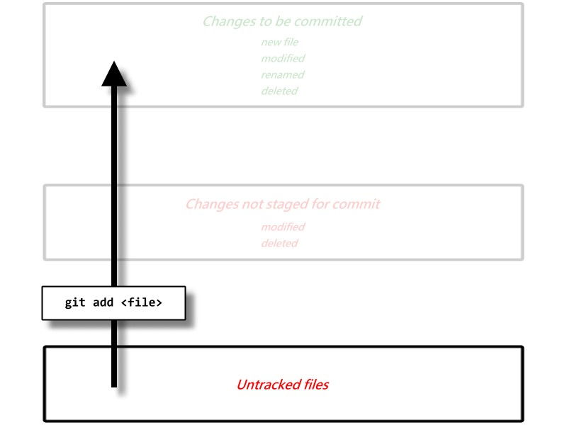
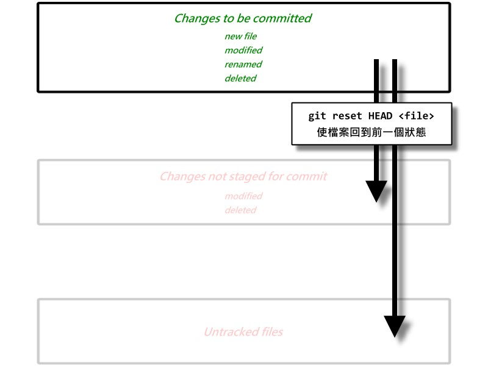
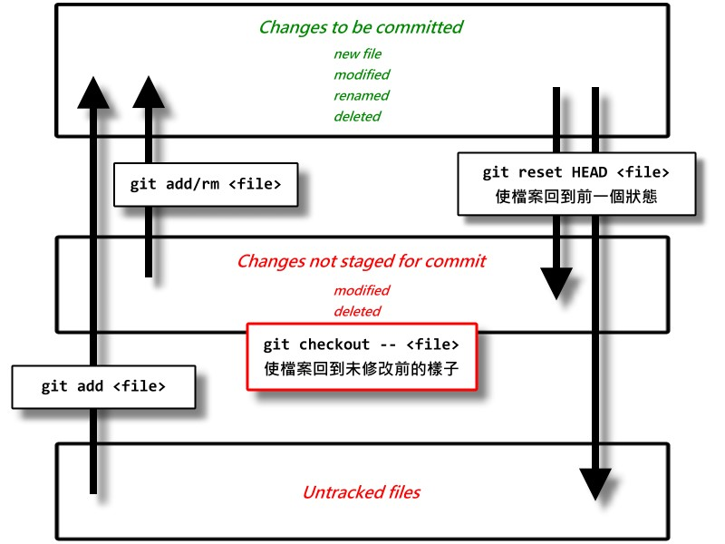

# 檔案狀態

在前面幾個章節，介紹完 git 的基本指令之後，我們現在要來說明 git 的檔案狀態

Git 將 __"尚未被提交"__ 的檔案分成三個區塊，由上而下分別是

* __Changes to be committed（將要提交的檔案）__
* __Changes not staged for commit（被更動但尚未要提交的檔案）__
* __Untracked files（未被追蹤的檔案）__

## _Untracked files（未被追蹤的檔案）_

意指完全新加入的檔案，不曾被提交過

由於 git 只會去追蹤（track）被提交過（committed）的檔案的被修改狀態，而不會去追蹤新進的檔案

因此這類型屬於 ___Untracked files___

<pre style="border: 1px solid grey">
<code>Untracked files:
  (use "git add &lt;file&gt;..." to include in what will be committed)</code>
<code style="color: red">
        _assets/git_config_local.png</code>
</pre>

* ___use "git add &lt;file&gt;..." to include in what will be committed___

    使用 `git add <file>` 的指令，使檔案狀態改為 ___Changes to be committed___

 

 

## _Changes not staged for commit（被更動但尚未要提交的檔案）_

這一類的檔案，都是先前就已經被提交過的檔案

git 會去 track 這些檔案的狀態，當檔案被修改（___modified___）或是刪除（___deleted___）的時候，就會出現在這裡

> 這裡所有的檔案（___modified & deleted___）可以使用 `git add -u` 一次全部轉到綠色區塊

<pre style="border: 1px solid grey">
<code>Changes not staged for commit:
  (use "git add &lt;file&gt;..." to update what will be committed)
  (use "git checkout -- &lt;file&gt;..." to discard changes in working directory)</code>
<code style="color: red">
        modified:   01_local/file_status.md
        modified:   SUMMARY.md</code>
</pre>

* ___use "git add &lt;file&gt;..." to update what will be committed___

    使用 `git add <file>` 的指令，使檔案狀態改為 ___Changes to be committed___

    > 若狀態為 ___deleted___ 的檔案，必須要用 `git rm <file>` 才能轉到 ___Changes to be committed___ 區塊

    > 某些較新版本的 git 才可以用 `git add` 加入 "被刪除" 的檔案

* ___use "git checkout -- &lt;file&gt;..." to discard changes in working directory___

    使用 `git checkout -- <file>` 的指令，使檔案回到 __"未修改"__ 前的樣子

 

 

## _Changes to be committed（將要提交的檔案）_

這些是我們透過 `git add, rm, mv` 轉移過來的檔案

在執行 `git commit` 之後，將會被一起提交到一個 patch 裡面

<pre style="border: 1px solid grey">
<code>Changes to be committed:
  (use "git reset HEAD &lt;file&gt;..." to unstage)</code>
<code style="color: green">
        modified:   01_local/SUMMARY.md
        new file:   01_local/file_status.md</code>
</pre>

* ___use "git reset HEAD &lt;file&gt;..." to unstage___

    使用 `git reset HEAD <file>` 可以將檔案還原到 __"未準備提交"__ 前的狀態

    > 若使用 `git reset HEAD` 而後面不帶 `<file>` 的話，會將這個區塊 "所有" 的檔案都一併還原到 __"未準備提交"__ 前的狀態

    > `HEAD` 是 git 特殊的關鍵字，用來表示你目前所在的 patch 的位置（我們後面會在做詳細的說明）

 

 

## 本章回顧

這些狀態切換的指令都不需要去記他

因為在做 `git status` 的時候，每個區塊都會有指令提示

只要心裡對這個圖有個概念就好了

> Git 官方網站有關於檔案狀態的介紹&nbsp;&nbsp;[[英文版]](https://git-scm.com/book/en/v2/Git-Basics-Recording-Changes-to-the-Repository)&nbsp;&nbsp;[[中文版]](https://git-scm.com/book/zh-tw/v1/Git-基礎-提交更新到儲存庫)

> 我覺得看 `File Status Lifecycle` 的圖並不是很好理解，不過大家還是可以參考一下
