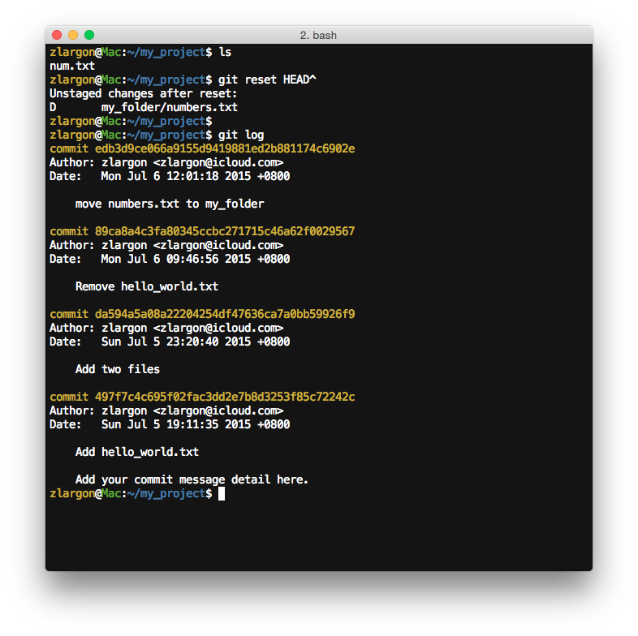
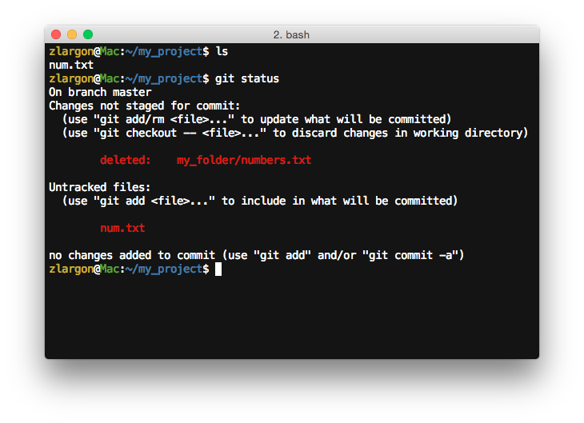
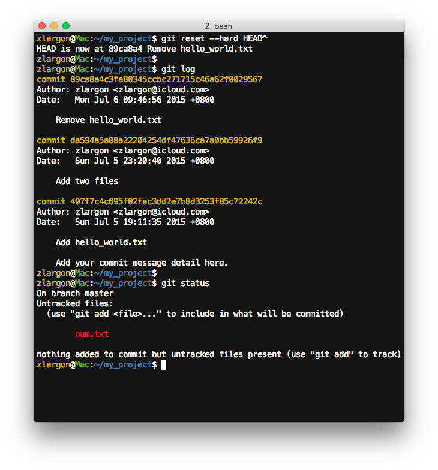
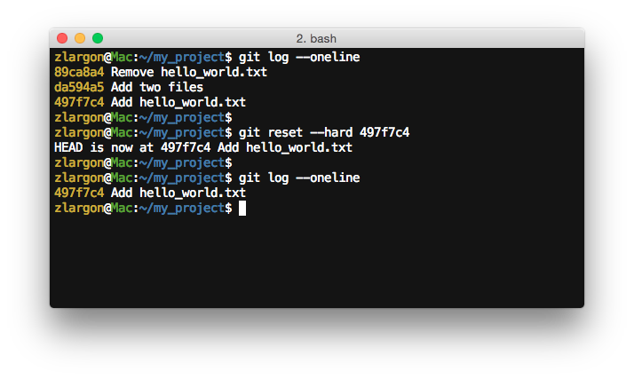
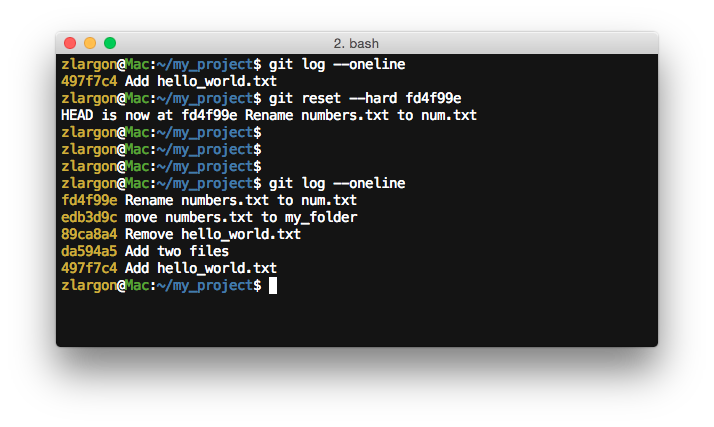

# Reset Patch

前面在 ["檔案還原"](../file/recover.md) 有提到 `git reset HEAD` 可以根據 `HEAD`（目前所在的 patch）還原全部的檔案狀態

___其實換句話說，`git reset HEAD` 就是還原到 `HEAD` 這個 patch 的意思___

有了這個概念之後，我們就可以試著切換到之前的 patch

## 使用 `git reset HEAD^` 回到上一個 patch

既然 `git reset HEAD` 是還原到 `HEAD` 這個 patch 的意思，那我們要回到上一個 patch，就只要改成用 `HEAD^` 就行了

```
$ ls
$ git reset HEAD^
$ git log
```



我們可以從 `git log` 看出，原本最後一個 patch 的提交紀錄已經不見了

接著我們在用 `git status` 來看目前的檔案狀態

```
$ ls
$ git status
```



我們從 `ls` 可以看出，目錄下的檔案內容並沒有發生改變

跟 reset 之前一樣只有 `num.txt` 一個檔案

只有 "檔案狀態" 發生改變而已

<br>

## 使用 `git reset --hard HEAD^` 回到上一個 patch，並且強制清除修改的內容

我們在 ["檔案還原"](../file/recover.md) 有提到，使用 `git reset --hard HEAD` 來還原所有檔案的內容

因此我們可以舉一反三，如果把 `HEAD` 改成 `HEAD^`

那麼就是回到上一個 patch 並且強制清除修改的內容

    $ git reset --hard HEAD^
    $ git log
    $ git status



現在從 `git log` 可以看初，又少了一個 patch，現在只剩下 3 個 patch

從 `git status` 也只剩下 `num.txt` 檔案落在 ___<span style="color: red">Untracked files</span>___

注意，git 不會去清除 `num.txt` 的內容，是因為他先前已經轉到 ___<span style="color: red">Untracked files</span>___ 區塊

而 git 本來就不會去追蹤這個區塊的任何變化

<br>

## 使用 `git reset --hard <commit id>` 直接 reset 成指定的 patch

我現在要 reset 到我們的第一次 commit 的 patch

我們可以先用 `git log` 來查詢我們第一個 patch 的 `commit id`

接著用 `git reset --hard <commit id>` 直接跳至該 patch

    $ git log --oneline         # 只顯示一行的 log 訊息 → 第一個 patch 的 commit id 為 497f7c4
    $ git reset --hard 497f7c4
    $ git log --oneline



<br>

我們除了可以還原之先前的 patch 之外，我們也可以透過 `git reset --hard <commit_id>` 跳至我們最後一次 commit 的 patch

之前我們最後一次 commit 的 patch id 為 `fd4f99e6db01d8d35d39a990aadfef44cb8a2986`

    $ git log --oneline
    $ git reset --hard fd4f99e
    $ git log --oneline



從 `git log` 可以看出，我們全部五個 patch 都回來了！

這個是一個非常實用的功能，可以快速的切換 patch！

<br>

## `git reset --hard` 的注意事項

* __如果我程式改內容到一半，不小心下了指令 `git reset --hard HEAD`，那我原本改的內容都就都不見了嗎？__

    > 是的，這無法補救... Orz

    > 但是如果你是使用 IDE 或是文字編輯器的話（例如：Sublime Text、Notepad++），請趕快回到編輯器使用 Ctrl + Z 大法

    > 第一時間還有機會救回來

<br>

* __如果我不小心用 `git reset --hard HEAD^^^...` 切回先前的 patch，然後又沒有把後來的 commit id 記下來，那該怎麼辦呢？__

    > 這一點可以不用擔心

    > 「凡走過必留下痕跡，凡 commit 過的 patch 都會留下紀錄」

    > git 會幫我們將所有 commit 過 patch 都存下來

    > 我們下一個章節將會教大家怎麼把 patch 救回來

<br>

## 本章回顧

* 使用 `git reset HEAD^` 回到上一個 patch（檔案內容不清空）

* 使用 `git reset --hard HEAD^` 回到上一個 patch，並且強制清除修改的內容

* 使用 `git reset --hard <commit id>` 直接 reset 成指定的 patch

<br><br><br>
