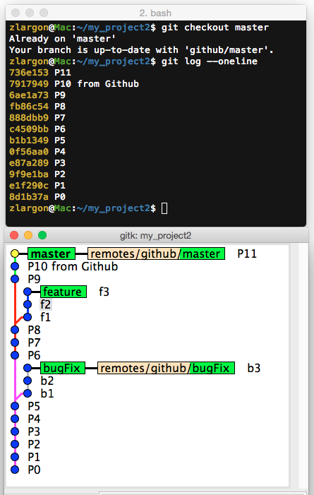
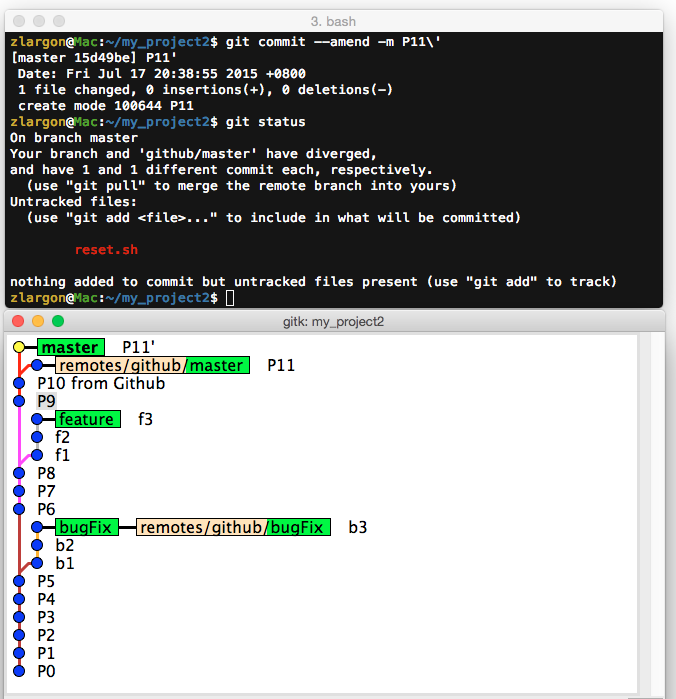
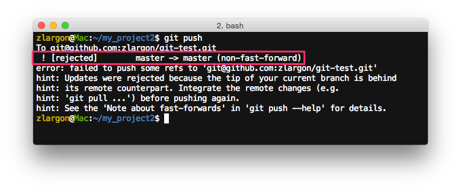
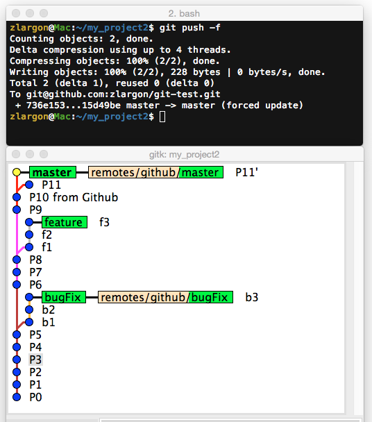

# 強制更新遠端分支

我們在 ["修改 / 訂正 Patch"](../patch/amend.md) 有提到

有時候我們在 local 端上 patch 會不小心打錯提交訊息，或是有一些小錯誤

我們不想要只為了一個錯誤，而另外再上新的 patch，所以我們會用 `git commit --amend` 來訂正他

但是如果我們已經 `push` 到 server 上的時候，要怎麼修正呢？

 

我們現在把 `master` 的 patch P11，用 `git commit --amend` 修改提交訊息成 P11'

我們從 `gitk` 也可以看到，現在 `master (P11')` 分支跟 `remotes/github/master (P11)` 已經不同步了

剛剛我們有設定 upstream，因此 git 有提供我們一些追蹤的資訊，表示 `master` 與 `github/master` 已經產生了分歧

<pre style="border: 1px solid grey">
Your branch and 'github/master' have diverged,
and have 1 and 1 different commit each, respectively.
  (use "git pull" to merge the remote branch into yours)
</pre>

 

如果我們現在把 `master` 分支 push 出去，會被 server 拒絕

如果做 `git pull` 會跑出 Merge Patch

如果做 `git pull --rebase` 會把 P11' 移到 P11 之後

這些都不是我們想要的結果

 

## 使用 `git push -f` 強制更新遠端分支

參數 `-f` 等同於 `--force`，表示強制的意思

他可以強迫上傳，並且覆蓋掉遠端的分支

 

> 注意：

> 如果我們沒有設定 upstream 的話，後面還是要加 `<remote name>` 跟 `<branch name>`

> `$ git push -f <remote name> <branch name>`

 

## 注意事項

在是多人協同開發一個專案的時候，`git push -f` 是非常危險的指令

很可能會不小心把別人上傳的 code 整個覆蓋掉

通常只有在單人開發，或是非常有把握的時候，才會用 `git push -f` 來強制更新分支

   
