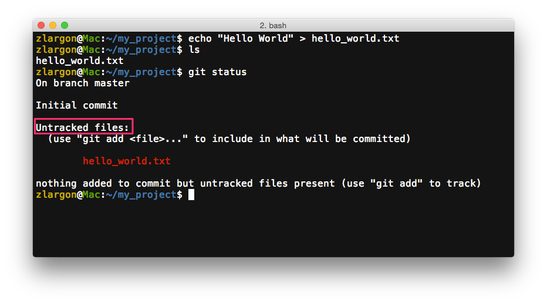
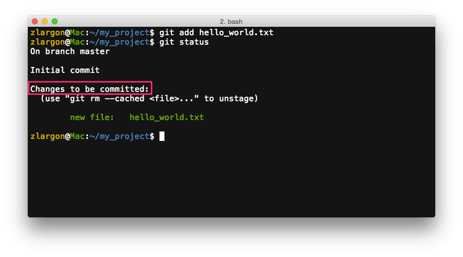
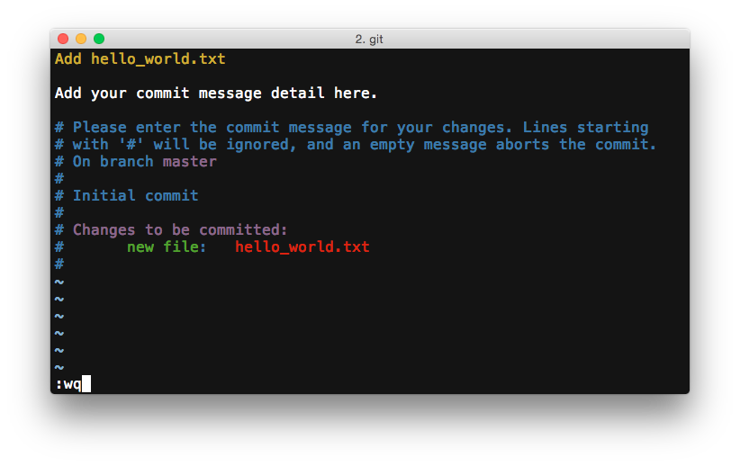
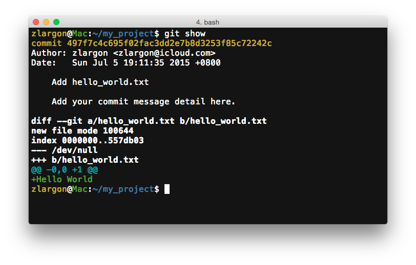

# 提交一個 Patch

首先，我們先新增一個 `hello_world.txt` 的檔案，內容為一行字串 `Hello World`

## 使用 `git status` 來檢視所有檔案的狀態

```
$ git status
```



我們這裡可以看到，目前 `hello_world.txt` 的狀態為 ___Untracked files___

表示這是一個全新的檔案（稍後我們會在 ["檔案狀態"](../file/status.md) 做更詳細的解釋）

<br>

## 使用 `git add <file>` 來告知 git，哪些是我們即將要提交（commit）的檔案

我現在現在打算要提交 `hello_world.txt`

```
$ git add hello_world.txt
$ git status
```

這時我們再用 `git status` 來檢視檔案的狀態



`hello_world.txt` 的狀態改變成綠色的 ___Changes to be committed___

表示這個檔案已經 "準備好" 要被提交（commit）了（稍後我們會在 ["檔案狀態"](../file/status.md) 做更詳細的解釋）

<br>

## 使用 `git commit` 來提交一個 patch

```
$ git commit
```

這時候會進入 `vim` 的文字編輯模式，編輯提交訊息（commit message）



* 第一行為 commit message 的標題（僅限一行）
* 第二行保留空白
* 第三行以後是 commit message 的內容（可略過不寫）

編輯完成後，存檔離開，便可完成這次的提交

<br>

## 使用 `git log` 檢視提交的歷史訊息

使用 `git log` 來檢視之前的提交的歷史訊息，他將會列出所有 patch 的資訊


<pre style="border: 1px solid grey">
<span style="color: #e6b422">commit 497f7c4c695f02fac3dd2e7b8d3253f85c72242c</span>
Author: zlargon &lt;zlargon@icloud.com&gt;
Date:   Sun Jul 5 19:11:35 2015 +0800

    Add hello_world.txt

    Add your commit message detail here.
</pre>

`commit` 是 git 幫我們自動產生的長度 40 字元的 Hash 值，並且保證 commit id 絕對不會重複，用來識別所有不同的 patch

`Author` 即為我們在前幾個章節透過 `git config` 所設定的 username 跟 email

> username 及 email 為 commit 時的必要欄位，因此必須事先設定好

下半部為提交訊息，包含標題及內容

<br>

這時候再做 `git status` 時會顯示

<pre style="border: 1px solid grey">
On branch master
nothing to commit, working directory clean
</pre>

表示目前此目錄下，沒有發生任何的更動

<br>

## 使用 `git show` 檢視 patch 的修改內容

```
$ git show
```

使用 `git show` 來檢視最後一次提交的 patch 所修改的內容



從 `git show` 可以看出，這個 patch 新增了一個 `hello_world.txt` 的檔案，內容為 `Hello World`

<br>

## 關於 Commit 與 Patch

本教學中所用到的 "patch" 其實正確來說，應該要用 "commit" 來稱呼

是沒錯，跟 git commit 一樣，也是叫 commit

不過一個是動詞，一個是名詞

對初學者來說，這還滿令人混淆的

比較正確的說法，應該是 "commit a commit"，而不是 "commit a patch"

然而在英文字典中，commit 只有動詞的字義，而找不到名詞的字義

    commit (v.) 犯罪；託付

git commit 比較接近於 "託付" → 交託 → 提交（submit）

> 其實 commit 不只有這兩個動詞字義，有興趣的人可以去查大字典 :D

> 其名詞型為 commitment，表示 "承諾" 的意思

<br>

Git 的作者已經完全將 commit 給名詞化了

不過 "commit a commit" 聽起來實在太繞口了，連外國人自己都不會這樣講

通常他們會講 "make/create a commit" 或是 "commit a change"

<br>

而我在教學裡面最後是決定用 patch 來取代稱呼 commit (n.)

希望可以降低 commit (v.) 跟 commit (n.) 對初學者造成的混淆

有些 open source 的文件在說明如何貢獻原始碼的時候，也可以看到 "commit/submit a patch" 的講法

會選用 patch 有部分是受到 [Gerrit](https://www.gerritcodereview.com/) 的啟發

但最主要是因為 git 裡面有一個指令就叫做 [`format-patch`](https://git-scm.com/docs/git-format-patch)

`format-patch` → 將 patch 格式化，產生實體檔案（patch file）

簡單來說，就是可以將一個或多個 commit (n.) 打包起來，然後用其他方式傳給別人（例如：Email）

這是一個比較進階，而且少見的指令，幾乎是不會用到的

只有少部分 open source 會要求貢獻者使用 patch file 來提交程式碼（例如：[FFmpeg](https://ffmpeg.org/developer.html#Submitting-patches)）

整體來說，commit (n.) 跟 patch 的概念是很相似的

雖然這不是正統的講法，但會相對比較好理解

<br>

## 本章回顧

* 使用 `git status` 來檢視所有檔案的狀態

* 使用 `git add <file>` 來告知 git，哪些是我們即將要提交（commit）的檔案

* 使用 `git commit` 來提交一個 patch，並且使用 `vim` 編輯提交訊息（包含標題及內容）

* 使用 `git log` 檢視提交的歷史訊息

* 使用 `git show` 檢視最後一次提交的 patch 所修改內容

<br><br><br>
